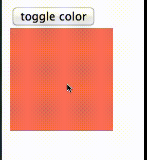

# DOM viz
DOM viz is a Chrome extension that visualizes DOM mutations.

It uses the [MutationSummary](https://code.google.com/p/mutation-summary/wiki/APIReference)
API to listen for certain types of DOM mutations
(e.g. changing the style of a DOM element), and highlights the mutated element using
a CSS3 animation.

# Examples
Highlighting updated twitter pods:


Using the wobble highlight effect:


The wobble highlight being triggered when an element changes color:


# How it works

### MutationSummary observer

The MutationSummary API exposes the `MutationSummary` object, which observes the DOM
for changes and calls your provided callback function.

The `MutationSummary` constructor takes an object specifier with a `callback`
field and a `query` field (among other optional fields):

```javascript
var observer = new MutationSummary({
  callback: mutationReactor,
  queries: [
    {attribute: 'style'},
    {element: '*'}
  ]
});
```
My "mutationReactor" callback is passed an array of mutation summaries, one for
each query specified in the `queries` field. Here I'm querying for style attribute
changes in the `attribute` query, and any element updates using the `element`
query:

```javascript
var mutationReactor = function(summaries) {
  // DOM element style updates:
  var styleSummaries = summaries[0];
  var styleReactor = reactorDispatch('style');
  styleSummaries.valueChanged.forEach(styleReactor);
  styleSummaries.added.forEach(styleReactor);
  styleSummaries.removed.forEach(styleReactor);

  // DOM elements added:
  var elementSummaries = summaries[1];
  var addReactor = reactorDispatch('add');
  elementSummaries.added.forEach(addReactor);
  elementSummaries.removed.forEach(addReactor);
  elementSummaries.reparented.forEach(addReactor);
  ...
}
```

My callback consumes the array of mutation summary objects, iterating through
each update type. For the element style mutations for example, there are `valueChanged`,
`added`, and `removed` update types.

The "reactorDispatch" function is responsible for returning callback functions
to use for each type of update to handle. Right now each type of update is handled
by the same underlying callback, which highlights the element with a yellow border:

```javascript
var reactorDispatch = function(type) {
  if (type == 'style') return highlightElement;
  else if (type == 'add') return highlightElement;
  else if (type == 'character') return highlightElement;
  else return undefined;
};
```
### CSS3 animations

My callback function consumes the element that has changed, and applies a CSS
animation to the element. Right now the CSS animation simply highlights the
element border, by toggling a class name on the element that styles the border:

```javascript
var highlightElement = function(changedElement) {
  ...
  // Add a solid border so my highlight animation can style it:
  if (!changedElement.className.match('framed'))
    changedElement.className += ' framed';
  ...
}
```

The CSS styles I use are kept within the extension layout (so no styles need
to be injected into the page being viewed at all):

```css
.framed {
  outline-style: solid;
  outline-color: yellow;
  -webkit-animation: highlight 1s 1 normal;
}
```

To prevent triggering further callbacks from the animation listener, 
I also toggle a dummy class called "animating" on the element as soon as the
animation starts:

```javascript
var highlightElement = function(changedElement) {
  ...
  // When the animation starts ...
  var beginAnimListen = function() {
    // ... add a class to flag it as currently animating:
    changedElement.className += changedElement.className ? ' animating': 'animating';
  };
  ...
}
```

I check for the presence of this dummy class at the start of the callback, and
if it's there I return immediately, since that means it's been triggered by
an animation event:

```javascript
var highlightElement = function(changedElement) {
  // If I'm currently changing this element, don't do anything:
  if (changedElement.className && changedElement.className.match(/animating/))
    return;
  ...
}
```

The `MutationSummary` API actually takes care of preventing such recursive callbacks
for you, _as long as_ the changes to the element are made _synchronously_ in the
callback. The animation listener callbacks happen asynchronously, so the API
doesn't help there.

## (A note on creating the above animated gifs)

I did a screen capture using Quicktime, and converted the generated .mov file to a gif using `ffmpeg`:
```bash
[rule146@rule146: Desktop]$ ffmpeg -i twitter-wobble-dom-viz.mov -s 906x466 -f gif - | gifsicle --optimize=3 > dom-viz-twitter-wobble-20140326.gif
```
